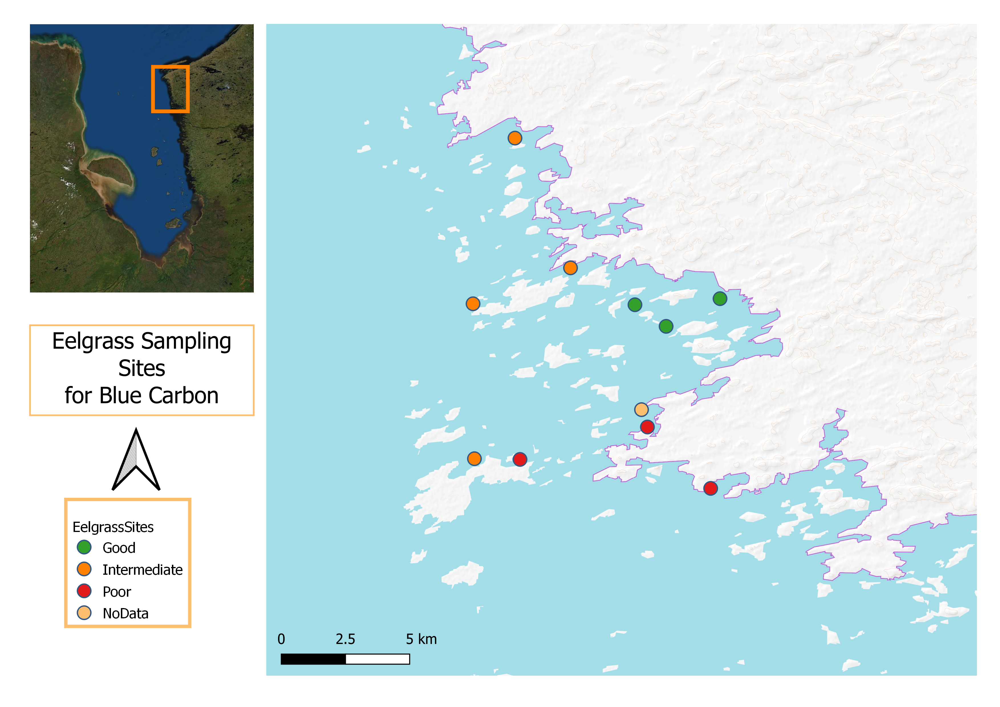
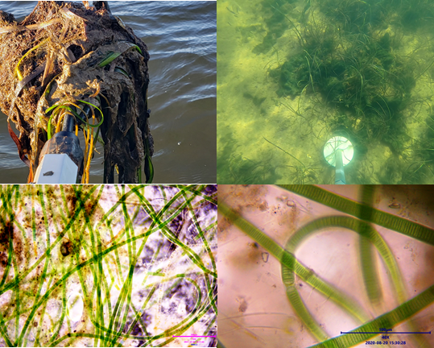
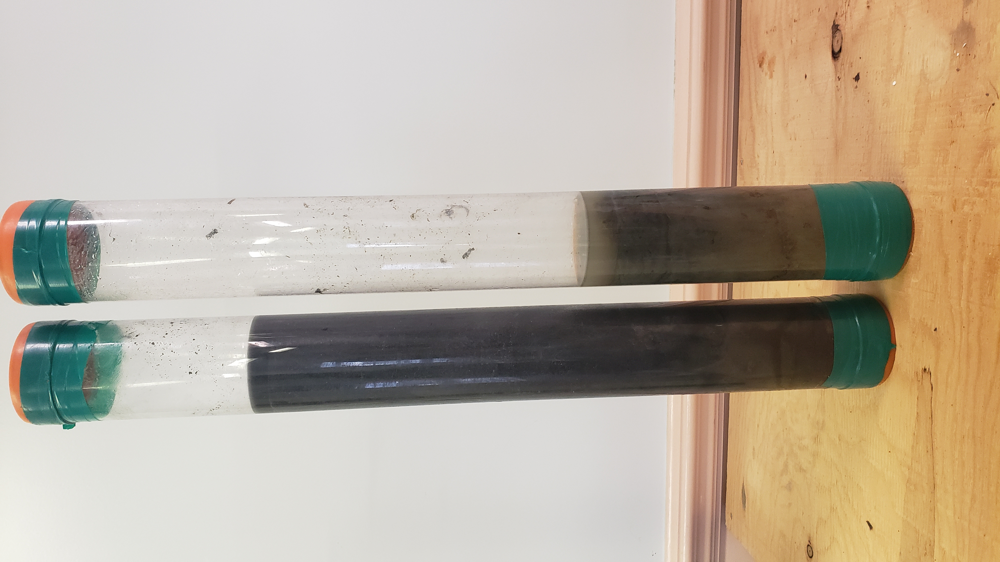
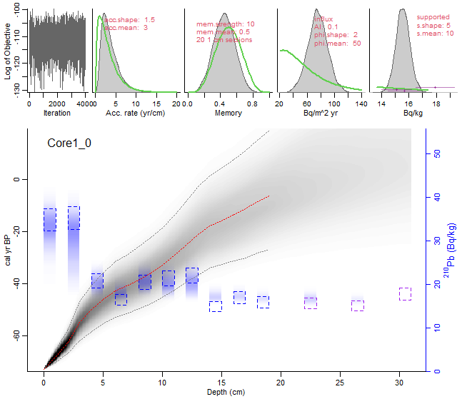
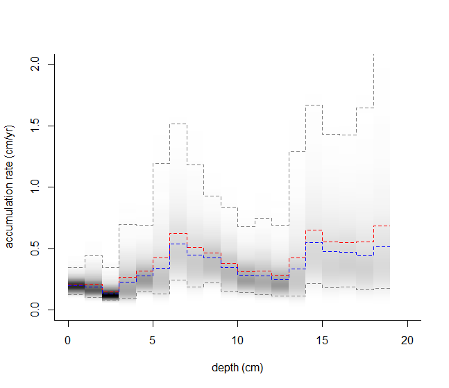
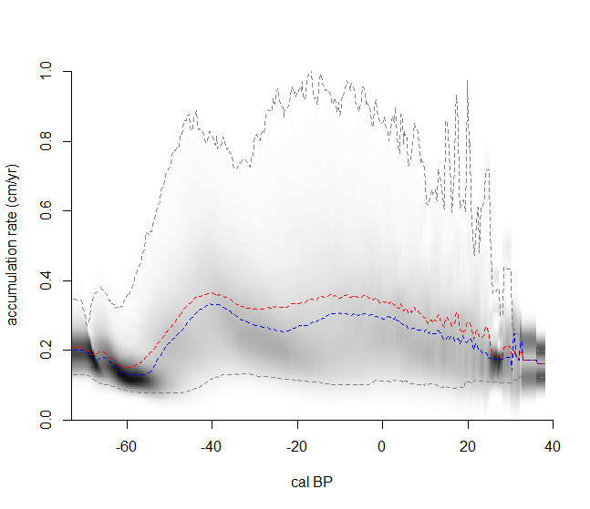
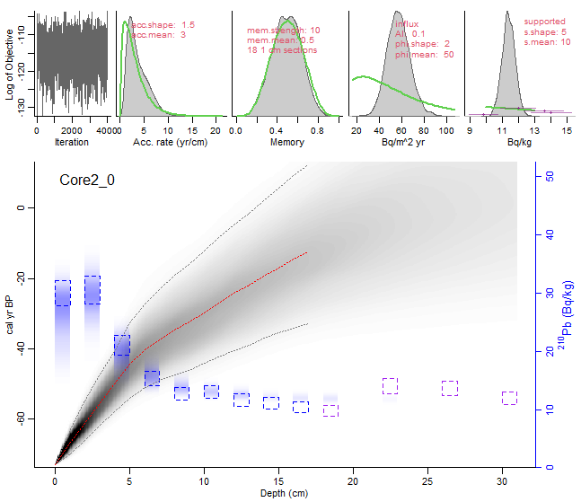
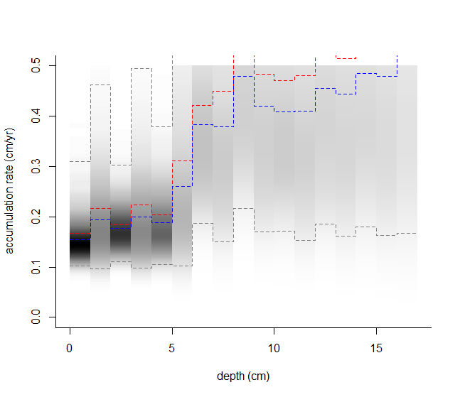
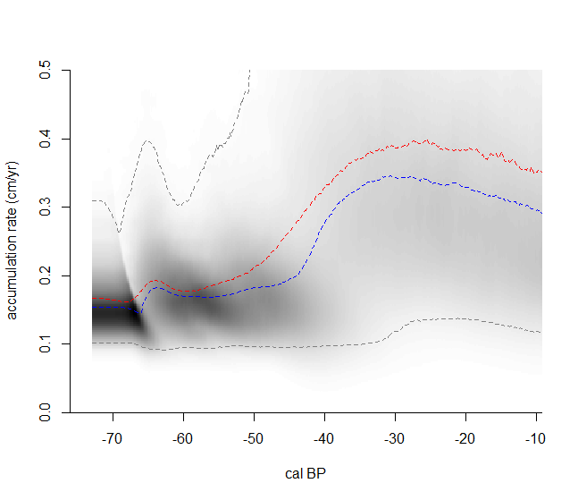

```{r setup, include=FALSE}
knitr::opts_chunk$set(echo = TRUE, warning = FALSE, message = FALSE)
```


\newpage


# Background
This project aims to build scientific capacity in Chisasibi by monitoring blue carbon ecosystems using environmental indicators stemming from Cree Traditional Ecological Knowledge (TEK) and environmental sciences. This project is one element of a longer-term initiative to develop an integrated, Indigenous-led, landscape-level conservation strategy across James Bay. In James Bay, blue carbon habitats are essential for their global contribution to climate change mitigation and their close link to sustaining the indigenous Cree way of life as crucial habitats for fish and migratory waterfowl. We focus on monitoring key blue carbon ecosystem indicators and assessing current and emerging threats to these systems and their potential impacts on Cree's traditional livelihoods. Through this project, we wish to build a framework for participatory environmental monitoring in Chisasibi that can be scaled up in other communities and contribute to conserving the blue carbon ecosystems in eastern James Bay.

# Objective
This project aims to initiate a long-term monitoring program to support community-driven decision-making on environmental conservation locally and across James Bay. Our approach is to monitor a suite of biophysical and climate change indicators in strategic blue carbon ecosystems using Cree TEK and scientific methods. Assessments will understand the cumulative impacts and emerging threats to these ecosystems. Monitoring activities will concentrate on the north of La Grande river. Using monitoring data, we hope to gain the necessary depth and breadth of knowledge to understand blue carbon ecosystems' current and future state, ecosystem services, and impacts on traditional practices through this strategy.

# Methods
We visited several sites (see Figure \ref{fig:sites}) during the summer of 2021, 2022, and 2023. We collected the following baseline data on eelgrass habitats using a suite of environmental monitoring methods.

```{r sites, echo=FALSE, fig.cap="Eelgrass ecosystem sampling locations", out.width = '100%', fig.align='center'}
library(knitr)


```

* Sediment cores: Coring techniques followed a protocol by Howard and colleagues [-@howard2014coastal]. 
* Historical and current distribution derived from satellite remove sensing and ground survey
* Collection and measurement of plant samples
* Water quality indicators using multi-parameter instruments, moored sensor and CTDs 
* Presence or absence of potentially harmful algal blooms are determined using underwater camera and manual scooping. 

We sent two sediment cores for analysis to the GEOTOP lab at the University of Quebec in Montreal to measure organic carbon determine the age of each section of the sediments using Lead assay(Pb210) techniques. The data were analyzed at CERRI for age and sediment accretion rates using Bayesian statistics [@aquino2018bayesian]. Using the results of the analyses we answered the following research questions: 

1. How much organic carbon (C) is James Bay blue carbon ecosystems accumulating per unit area per year? 
2. What are the threats to blue carbon ecosystems, and how do these threats affect the sequestration rate of blue carbon in James Bay and their traditional ecosystem services? 
3. What is the state of James Bay eelgrass and other coastal ecosystems as blue carbon sinks/sources?
4. How does climate change impact blue carbon accumulation in James Bay?
5. What management actions best maintain and promote carbon sequestration and traditional use of blue carbon ecosystems in James Bay? 

# General Project Accomplishments

## Procurement of laboratory equipment
**Percent accomplishment: 100**

Despite delays in procurement and delivery, the project acquired needed scientific and field equipment and successfully carried out fieldwork. All the equipment and consumables needed for water quality monitoring have been delivered. Purchase of additional equipment is ongoing.

## Sampling program
**Percent accomplishment: 100**

The trapline tallymen provided the knowledge that guided site selection. These sites are precise and have a long history of resource use and they also represent areas where land users have observed environmental changes throughout the years. Last fall, we finally collected sediment cores from 2 target sites, one with thriving eelgrass and one from marginal eelgrass beds.

## Analyses of core samples
**Percent accomplishment: 100 ** 

Since istotopic  and organic content analyses are not possible with the current setup at CERRI, two cores were sent out to the GEOTOP lab at the University of Quebec in Montreal. The results has been received and interpretation of the data are finished. 

## Hiring and training of local youth
**Percent accomplishment: 100 ** 

The funding contributed to the partial salaries of two local youth co-researchers. These co-researchers were involved in all the fieldwork  and were trained to conduct core sampling and preparation of core sections.  They received training in using a universal coring device, core extrusion, and core sectioning in the field.
 
## Community presentation 
**Percent accomplishment: 90 ** 

We made two presentations to the CERRI board about the project and one presentation to the general community assembly. Community members were learning blue carbon and climate change concepts. The community were interested in exploring the synergy between enhancing the blue carbon ecosystem to make them more productive as a carbon sink and waterfowl habitats. They also wanted to know more about algae and cyanobacteria and how it affects traditional resources like fisheries. Another community presentation is planned in July to report back to the community the results of the research.

\newpage

# Research results
## General eelgrass state and ecology 

Eelgrass beds at the two coring sites are marginally different. Eelgrass plants on the first site (Core Site 04) were healthier and cleaner, and had longer leaves. On the contrary, the second sampling location has marginal to no eelgrass growth (Core site 01). Also, the second eelgrass site had enourmous mats of microalgae and cyanobacteria (Figure \ref{fig:bacteria} ). We identified these species belonging to  the family *Oscillatoriaceae*, probably *Oscillatoria spp* or *Lyngbya confervoides* previously recorded by Mathieson and company[-@mathieson2010floristic]. 

```{r bacteria, echo=FALSE, fig.cap="Mats and microscopic images of filamentous cyanobacteria", out.width = '100%', fig.align='center'}


```

## Sediment core characteristics
The sediment cores varied in length and substrate characteristics (Figure \ref{fig:cores}). The site with eelgrass had the deepest sediment at 96 cm while the marginal eelgrass site had about 65 cm. In addition, the site with eelgrass is more silty and clayey while the other site had more sand.

```{r cores, echo=FALSE, fig.cap="Eelgrass sediment cores", out.width = '50%', fig.align='center', out.extra='angle=-90'}


```

### Isotope Analyses
Stable isotope analyses provide valuable insights into the nature of James Bay eelgrass sediments. The results are expressed in delta notation ($\delta$) measures the ratios of stable isotopes of carbon(13C/12C) and nitrogen(15N/14N) in samples.  Results  expressed as part per thousand (ppt)  deviation from a standard material. $\delta$ 13C values provides information of the carbon sources in the sediment while $\delta$ 15N values values provide information about the nitrogen sources and cycling in the ecosystem. In marine environments, $\delta$ 15N values can vary widely, influenced by sources of nitrogen (like upwelling, nitrogen fixation, or anthropogenic inputs) and processes like denitrification. 

The $\delta$ 13C ranges are typicall between -300&#8240; to +50&#8240;.  More negative values indicate a dominance of terrestrial influence (tress and shrubs-C3 plants), while less negative values suggest marine sources (C4 plants). Typical $\delta$ 13C values of seagrass is around -11&#8240; closely resembling C4 species. C3 and c4 plants in terrestrial environments have $\delta$ 13C values around -28&#8240;  to -14&#8240;, respectively (Touchette and Burkholder 2000).

The $\delta$ 13C results from the core sample with eelgrass (C04) ranges from -14.7&#8240; to -24.91&#8240; while the core with marginal eelgrass (C01) ranges from -15.97&#8240; to -20.58&#8240;. The more negative values in lower end of core C04 values indicate significant incorporation or mixing of terrestrial organic matter, which is typically more 13C-depleted compared to marine organic matter while the range of values in Core 01 suggests a predominance of marine organic carbon with a possible minor influence from terrestrial sources(Canuel et al., 1997).

On the other hand, the $\delta$ 15N values in core C01 (marginal eelgrass) range from +2.00&#8240; to +5.71&#8240; and the core with healthy eelgrass (C04) had $\delta$ 15N values between 1.79&#8240; and 4.44&#8240;both suggest that marine primary production and early consumer interactions dominate (eelgrass and phytoplankton) as sources of nitrogen with little influence from denitrification or terrestrial inputs. 

### Percent Organic Carbon

The core from marginal eelgrass has more organic carbon than the core from healthy looking eelgrass see Table \ref{tab:percentc}.

```{r percentc, echo=FALSE, message=FALSE, warning=FALSE}
library(readxl)
library(dplyr)
library(knitr)

# Load the data from Excel file
data <- read_excel("loi_data.xlsx")

# Calculate summary statistics for percent organic carbon for each site
cpercent <- data %>%
  group_by(SITEID) %>%
  summarise(
    Count = n(),
    Mean = mean(`%C-org`, na.rm = TRUE),
    SD = sd(`%C-org`, na.rm = TRUE),
    Min = min(`%C-org`, na.rm = TRUE),
    `1st Qu.` = quantile(`%C-org`, 0.25, na.rm = TRUE),
    Median = median(`%C-org`, na.rm = TRUE),
    `3rd Qu.` = quantile(`%C-org`, 0.75, na.rm = TRUE),
    Max = max(`%C-org`, na.rm = TRUE)
  ) %>%
  ungroup() # to remove the grouping

# Use knitr to create a table in the output document
knitr::kable(cpercent, format = "latex", caption = "Summary Statistics of Percent Organic Carbon")
```

The t-test comparing the percent organic carbon (%C-org) between the two sites yields a t-statistic of approximately 4.456 and a p-value of approximately 0.0000507. Given that the p-value is less than the common significance level of 0.05, we can reject the null hypothesis and conclude that site C01(marginal eelgrass) has a significantly higher organic carbon than the site with eelgrass (C04).

Regarding soil organic carbon density, site C01 has a higher mean soil organic carbon density as well as a higher median, indicating generally greater organic carbon density in the soil at this site compared to site C04 (Table \ref{tab:cdense}). The variability, as indicated by the standard deviation, is also lower at C01 than at C04. 


```{r cdense, echo=FALSE, message=FALSE, warning=FALSE}
library(readxl)
library(dplyr)
library(knitr)

# Load the data from Excel file
data <- read_excel("loi_data.xlsx")

# Calculate summary statistics for soil organic carbon density for each site
summary_stats_denc <- data %>%
  group_by(SITEID) %>%
  summarise(
    Count = n(),
    Mean = mean(SoilOrgCDensity_gcm3, na.rm = TRUE),
    SD = sd(SoilOrgCDensity_gcm3, na.rm = TRUE),
    Min = min(SoilOrgCDensity_gcm3, na.rm = TRUE),
    `1st Qu.` = quantile(SoilOrgCDensity_gcm3, 0.25, na.rm = TRUE),
    Median = median(SoilOrgCDensity_gcm3, na.rm = TRUE),
    `3rd Qu.` = quantile(SoilOrgCDensity_gcm3, 0.75, na.rm = TRUE),
    Max = max(SoilOrgCDensity_gcm3, na.rm = TRUE)
  ) %>%
  ungroup() # to remove the grouping

# Use knitr to create a table in the output document
knitr::kable(summary_stats_denc, format = "latex", caption = "Summary Statistics of Soil Organic Carbon Density (g/cm³)")
```

### Lead (Pb)210 Dating

1. Lead 210 results from Core 01 with marginal eelgrass are summarized in Table 3. 

```{r echo=FALSE, message=FALSE, warning=FALSE}
library(rplum)
library(tidyr)
library(ggplot2)
library(readr)
alta_co1 <-read_csv("c01Data.csv")%>% drop_na()%>%
  transmute(
    'Depth (cm)' = depthCm,
    'Density g/cm^3' = dbdCm3,
    '210Pb (Bq/Kg)' = activityPb210,
    'sd(210Pb)' = sdPb210,
    'Thickness (cm)' = thicknessCm3
  
  )

knitr::kable(alta_co1, format = "markdown", caption = "C01: Core data from marginal eelgrass site ")

```

The rPlum model was initiated using the deepest 3 centimeters of the Pb210 readings as background value. No supplementary radiocarbon data was used. Figure 4 shows the result of the best fitted with the following default parameters: 

* accretion mean: 3
* accretion shape: 1.5 
* memory mean: 0.5

```{r co1model, fig.align = "default", fig.cap="Core 1 rPlum model run", echo=FALSE, message=FALSE, warning=FALSE}
library(knitr)


```


```{r agedepth1, fig.show='hold', out.width="50%", fig.align = "default", fig.cap="Accretion by age and depth", echo=FALSE, message=FALSE, warning=FALSE}
library(knitr)


```

The age estimate of the core was between 26-45 years at 19 cm (see Figure 5). On the top layer, sediments accumulate at 0.21 cm/yr. Higher accumulation rates were found at deeper part of the core. For example, at 19 cm deep, the accumulation rate was  1.2 cm/yr. This corresponds to -6 cal BP or 1956 CE. After -50 BP (2000 CE) the accumulation rate drastically decrease.

2. Lead 210 results from Core 4: Healthy eelgrass site 
The results are summarized in Table 4.

```{r echo=FALSE, message=FALSE, warning=FALSE}

library(readxl)

c02Data <- read_excel("c02Data.xlsx")
knitr::kable(c02Data, format = "markdown", caption = "C02: Core data from healthy eelgrass site ")

```

The rPlum model was initiated using  Pb210 values of the deepest sections of the core of the as background values. No supplementary radiocarbon data was used. Figure 4 shows the result of the best fitted with the following parameters: 

* accretion mean: 3
* accretion shape: 1.5 
* memory mean: 0.5

The age estimate of the core was between 27-44 years at 17 cm (see Figure xx). On the top layer, sediments accumulate at 0.17 cm/yr. Higher accumulation rates were found at deeper part of the core. For example, at 15 cm deep, the accumulation rate was  1.4 cm/yr. This corresponds to -12 cal BP or 1962 CE.  There was a drastic decrease in accretion rate after cal BP -40 (i.e., 1990 CE) to 0.2 cm/yr and has been decreasing since then.

```{r co2model, fig.align = "default", fig.cap="Core 2 rPlum model run", echo=FALSE, message=FALSE, warning=FALSE}
library(knitr)


```


```{r agedepth2, fig.show='hold', out.width="50%", fig.align = "default", fig.cap="Accretion by age and depth", echo=FALSE, message=FALSE, warning=FALSE}
library(knitr)


```

\newpage

# Discussion 

1. How much organic carbon (C) is James Bay blue carbon ecosystems accumulating per unit area? 
Based on our calculation, the average soil organic carbon density of the two sites was approximately 0.02055 g/cm^3^, which translates to 20.55 kg/m^3^. At this density 

**Carbon Sequestered in 1 square kilometer of eelgrass Soil**  

Based on the previous calculation, the average soil organic carbon density of the two sites was approximately 0.02055 g/cm³, which translates to 20.55 kg/m³ when converted to kilograms per cubic meter (kg/m³).

**Carbon Sequestered in 1 Square Kilometer of Eelgrass Soil:**

Given that the volume of soil in 1 square kilometer area with 1 meter thickness = \(1,000,000 \, \text{m}^2 \times 1 \, \text{m} = 1,000,000 \, \text{m}^3\). The amount of carbon sequestered = Volume of soil \(\times\) Average soil carbon density = \(1,000,000 \, \text{m}^3 \times 20.55 \, \text{kg/m}^3 = 20,550,000 \, \text{kg}\) of carbon.

**Equivalent Motor Vehicle Emissions:**

Assuming 1 kg of soil organic carbon sequesters about 3.67 kg of CO2 (based on the molecular weight ratio of CO2 to C), the total CO2 sequestered would be \(20,550,000 \, \text{kg} \times 3.67 = 75,417,350 \, \text{kg of CO2}\). Converting kilograms to metric tons (since 1 metric ton = 1,000 kg), we get \(75,417,350 \, \text{kg} / 1,000 = 75,417.35 \, \text{metric tons of CO2}\). And given that an average passenger vehicle emits about 4.6 metric tons of CO2 per year, the number of vehicle emissions this amount of CO2 sequestration represents is \(75,417.35 \, \text{metric tons CO2} / 4.6 \, \text{metric tons CO2/vehicle/year} \approx 16,393.77 \, \text{vehicles/year}\). Therefore, a square kilometer of eelgrass soil with 1 meter thickness, having the average soil carbon density observed in the two sites, can sequester approximately 75,417.35 metric tons of CO2. This is equivalent to the annual emissions from approximately 16,394 motor vehicles.

2. What are the threats to blue carbon ecosystems, and how do these threats affect the sequestration rate of blue carbon in James Bay and their traditional ecosystem services? 

Eelgrass in James Bay are threatened by development in inland watershed.  The most significant of these development is the contruction and operation of hydro-electric complex in the region. When the dams were built,some of the major rivers 

3. What is the state of James Bay eelgrass and other coastal ecosystems as blue carbon sinks/sources?
At present, the eelgrass in James Bay is a marginal carbon sink.  Since the 1990s they are not building their sediment as fast as historic rates. If these rate continues and the eelgrass fails to recover, eelgrass beds in Chisasibi with be a net carbon source. 

4. How does climate change impact blue carbon accumulation in James Bay?
Climate change may enhance the capacity eelgrass to absorb more carbon, but in the presence of disturbance such as altered hydrology, they may become carbon sources. Other ecosystem such as marshes and peatlands may expand with rising global temperature which can significantly offset regional emissions, however the presence of land development such as hydro and mining can reduce extent of peatlands and marshes and may cause further methane emission.

5. What management actions best maintain and promote carbon sequestration and traditional use of blue carbon ecosystems in James Bay?

Improving the state of eelgrass beds by restoration can help bring back the historical extent of eelgrass beds. However, with constant stressors such as altered hydrology from  damming of rivers, it is unlikely that sediment accretion rates would improve. It would be more successful if eelgrass in other areas not affected by La Grande complex can be restored or enhance. 

* Understanding the roles and impacts of toxic cyanobacteria in James Bay is beyond the scope of this study, but it is an emerging field of research at CERRI.

# Conlcussion
* There is to some extent a detectable portion of organic sediments coming from inland that is being deposited on eelgrass beds. Further research is needed to determine whether these organic matter is coming from a single river or from multiple rivers. 

* Sediments in both healthy and marginal eelgrass beds are becoming more sandy with less organic matter and accumulate less and less through time. 

\newpage

# Expenses

\newpage
# References
