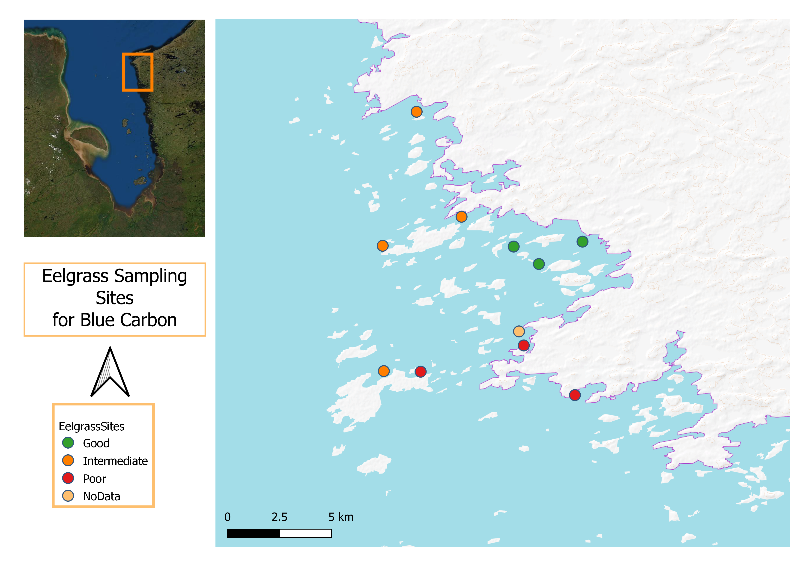
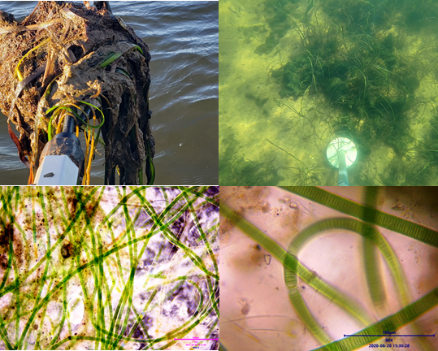

\newpage

```{r include=FALSE}
library(knitr)
opts_chunk$set(echo = TRUE)
# Shortcut to insert code block Ctrl+Alt+I

```

# Background
This project aims to build scientific capacity in Chisasibi by monitoring blue carbon ecosystems using environmental indicators stemming from Cree Traditional Ecological Knowledge (TEK) and environmental sciences. This project is one element of a longer-term initiative to develop an integrated, Indigenous-led, landscape-level conservation strategy across James Bay. In James Bay, blue carbon habitats are essential for their global contribution to climate change mitigation and their close link to sustaining the indigenous Cree way of life as crucial habitats for fish and migratory waterfowl. We focus on monitoring key blue carbon ecosystem indicators and assessing current and emerging threats to these systems and their potential impacts on Cree's traditional livelihoods. Through this project, we wish to build a framework for participatory environmental monitoring in Chisasibi that can be scaled up in other communities and contribute to conserving the blue carbon ecosystems in eastern James Bay.

# Objective
This project aims to initiate a long-term monitoring program to support community-driven decision-making on environmental conservation locally and across James Bay. Our approach is to monitor a suite of biophysical and climate change indicators in strategic blue carbon ecosystems using Cree TEK and scientific methods. Assessments will understand the cumulative impacts and emerging threats to these ecosystems. Monitoring activities will concentrate on the north of La Grande river. Using monitoring data, we hope to gain the necessary depth and breadth of knowledge to understand blue carbon ecosystems' current and future state, ecosystem services, and impacts on traditional practices through this strategy.

# Methods
We visited several sites during the summer of 2021, 2022, and 2023. Using a suite of environmental monitoring methods, we collected the following baseline data on eelgrass habitats.
* Sediment cores
* Historical and current distribution
* Collection and measurement of plant samples
* Water quality indicators
* Presence or absence of potentially harmful algal blooms

In addition, we Sent the sediment cores for analyses to the GEOTOP lab at the University of Quebec in Montreal and obtained the results of organic carbon estimates and Lead210 dating for the accumulation rates. 

These s data will be integral to assessing the target ecosystems' role as greenhouse gas sinks or sources. The information also contributes to answering guide questions about the state of the target ecosystem:

1. How much organic carbon (C) is James Bay blue carbon ecosystems accumulating per unit area per year? 
2. What are the threats to blue carbon ecosystems, and how do these threats affect the sequestration rate of blue carbon in James Bay and their traditional ecosystem services? 
3. What is the state of James Bay eelgrass and other coastal ecosystems as blue carbon sinks/sources?
4. How does climate change impact blue carbon accumulation in James Bay?
5. What management actions best maintain and promote carbon sequestration and traditional use of blue carbon ecosystems in James Bay? 

# Accomplishments to Date
* Collection of sediment cores
* Ten days of fieldwork on eelgrass sites of potential coring for organic carbon estimation (Figure 1)
* Collected environmental and other water quality parameters
* Collected and measured eelgrass samples
* Collected traditional knowledge on the historical distribution of eelgrass
* Collection and identification of harmful algal or cyanobacterial blooms and diatoms
* Analyses of core sections for percent organic carbon, Pb210 dating, and sediment accretion rates.

```{r echo=FALSE, fig.cap="Eelgrass ecosystem sampling locations", out.width = '100%', fig.align='center'}


```
## Procurement of laboratory equipment
**Percent accomplishment: 100**

Despite delays in procurement and delivery, the project acquired needed scientific and field equipment and successfully carried out fieldwork. All the equipment and consumables needed for water quality monitoring have been delivered. Purchase of additional equipment is ongoing.

## Sampling program
**Percent accomplishment: 100**

The trapline tallymen provided the knowledge that guided site selection. These sites are precise and have a long history of resource use and they also represent areas where land users have observed environmental changes throughout the years. Last fall, we finally collected sediment cores from 2 target sites, one with thriving eelgrass and one from marginal eelgrass beds.

## Analyses of core samples
** Percent accomplishment: 95** 
Two cores were sent out to the GEOTOP lab at the University of Quebec in Montreal for percent organic carbon, isotope analyses, and Pb210 dating. The results has been received and interpretation of the data are on-going. 

## Hiring and training of local youth

The funding contributes to the partial salaries of 2 co-researcher. This co-researcher was involved in all the fieldwork  and were trained to conduct core sampling and preparation of core sections.  They received training in using universal coring devices and core extrusion in the field.
 
## Community meeting with or presenting to local leadership and/or community ** 

We made two presentations to the CERRI board about the project and one presentation to the general community assembly. Community members were learning blue carbon and climate change concepts. The community were interested in exploring the synergy between enhancing the blue carbon ecosystem to make them more productive as a carbon sink and waterfowl habitats. They also wanted to know more about algae and cyanobacteria and how it affects traditional resources like fisheries.

## Key Findings
### Eelgrass 

The most striking morphometric differences among eelgrass sites were the plants' length, number of leaves, internode length, and leaf necrosis (black leaves). Because of this, it it is likely that eelgrass with necrotic black leaves could negatively influence goose feeding activity and their capacity to store carbon.  

```{r echo=FALSE, fig.cap="Typical eelgrass characteristics of the surveyed sites)", out.width = '50%', fig.align='center'}
knitr::include_graphics("eelgrass.jpg")

```

### Cyanobacteria
Most of the eelgrass beds we surveyed are in poor states and are colonized by a potentially toxic species of cyanobacteria (Figure 2).  We are consulting with other researchers who can provide more information about the identity of the species, its toxicity, impacts, and prospects of preventing its overgrowth.

```{r echo=FALSE, fig.cap="Mats and microscopic images of filamentous cyanobacteria", out.width = '100%', fig.align='center'}


```

### Sediment cores
Despite the cores being burnt down we were able to measure the thickness of the sediments we had collected in the sampling sites. The three sites we sampled have varying sediments depths from 25 cm to 39.25cm with an average core depth of 32.00cm. 

```{r, echo=FALSE}
#str(biota)
library(readxl)
cores <- read_excel("CORES.xlsx", sheet = "SUMMARY")
knitr::kable((cores), caption = "Core Depths")
```

```{r echo=FALSE, fig.cap="Eelgrass sediment cores", out.width = '50%', fig.align='center', out.extra='angle=-90'}
knitr::include_graphics("sedcores.jpg")

```

# Challenges
The following challenges have delayed the implementation of some project activities

* COVID restrictions impacted travel plans and community engagements
* Resignation of the anthropologist has delayed gathering of traditional ecological knowledge
* Windy and rough seas made it challenging to conduct more field surveys  
* Limited access – only two eelgrass beds are at the intertidal zone
* Delays from scientific instrument suppliers
* Fire has destroyed our core samples when our storage building burnt down

```{r echo=FALSE, fig.cap="Laboratory Fire", out.width = '120%', fig.align='center'}


```

\newpage

# Key updates to the workplan
* Re-sampling eelgrass and marsh sites (2 cores each as funding allows)
* Send cores to a laboratory (McGill University or UQAM)
* Analyze and write a report/publication

# Current Expenditures
Table 1 provides detail on the current expenditures.

```{r, echo=FALSE}
#str(biota)
library(readxl)
spent <- read_excel("FUNDING.xlsx")
knitr::kable((spent), caption = "Summary of Expenditures")
```

The remaining funds allocated for processing of the samples were not spent. As such we hope to re-sample limited areas and use the funds to pay for the costs related to core sample analyses.